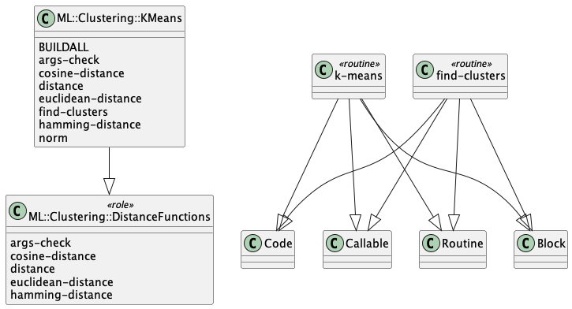

# Raku ML::Clustering

[](http://sparrowhub.io:2222)
[](https://opensource.org/licenses/Artistic-2.0)

This repository has the code of a Raku package for
Machine Learning (ML)
[Clustering (or Cluster analysis)](https://en.wikipedia.org/wiki/Cluster_analysis)
functions, [Wk1].

The Clustering framework includes the algorithms 
[K-means](https://en.wikipedia.org/wiki/K-means_clustering) 
and 
[K-medoids](https://en.wikipedia.org/wiki/K-medoids), 
and the distance functions Euclidean, Cosine, Hamming, Manhattan, and others,
and their corresponding similarity functions.

The data in the examples below is generated and manipulated with the packages
["Data::Generators"](https://raku.land/zef:antononcube/Data::Generators),
["Data::Reshapers"](https://raku.land/zef:antononcube/Data::Reshapers), and
["Data::Summarizers"](https://raku.land/zef:antononcube/Data::Summarizers), described in the article
["Introduction to data wrangling with Raku"](https://rakuforprediction.wordpress.com/2021/12/31/introduction-to-data-wrangling-with-raku/),
[AA1].

The plots are made with the package
["Text::Plot"](https://raku.land/zef:antononcube/Text::Plot), [AAp7].

-------

## Installation

Via zef-ecosystem:

```shell
zef install ML::Clustering
```

From GitHub:

```shell
zef install https://github.com/antononcube/Raku-ML-Clustering
```

-------

## Cluster finding 

Here we derive a set of random points, and summarize it:

```perl6
use Data::Generators;
use Data::Summarizers;
use Text::Plot;

my $n = 100;
my @data1 = (random-variate(NormalDistribution.new(5,1.5), $n) X random-variate(NormalDistribution.new(5,1), $n)).pick(30);
my @data2 = (random-variate(NormalDistribution.new(10,1), $n) X random-variate(NormalDistribution.new(10,1), $n)).pick(50);
my @data3 = [|@data1, |@data2].pick(*);
records-summary(@data3)
```

Here we plot the points:

```perl6
use Text::Plot;
text-list-plot(@data3)
```

**Problem:** Group the points in such a way that each group has close (or similar) points.

Here is how we use the function `find-clusters` to give an answer:

```perl6
use ML::Clustering;
my @cls = |find-clusters(@data3, 2, prop => 'Clusters');
@cls>>.elems
```

Here is are sample points from each found cluster:

```perl6
.say for @cls>>.pick(3);
```

We can verify the result by looking at the plot of found clusters:

```perl6
my @p1 = text-list-plot(@cls[0], point-char => '▽', x-limit => (1, 14), y-limit => (3.5, 13), width => 120, height => 25)>>.comb.flat;
my @p2 = text-list-plot(@cls[1], point-char => '☐', x-limit => (1, 14), y-limit => (3.5, 13), width => 120, height => 25)>>.comb.flat;
my @p3 = (@p1 Z @p2).map({ $_[0] eq ' ' ?? $_[1] !! $_[0] });
say @p3.join;
```

The function `find-clusters` can return results of different types controlled with the named argument "prop".

**Remark:** By default `find-clusters` uses the K-means algorithm. The functions `k-means` and `k-mediods`
call `find-clusters` with the option settings `method=>'K-means'` and `method=>'K-mediods'` respectively.


-------

## Implementation considerations

### UML diagram

Here is a UML diagram that shows package's structure:




The
[PlantUML spec](./resources/class-diagram.puml)
and
[diagram](./resources/class-diagram.png)
were obtained with the CLI script `to-uml-spec` of the package "UML::Translators", [AAp6].

Here we get the [PlantUML spec](./resources/class-diagram.puml):

```shell
to-uml-spec ML::AssociationRuleLearning > ./resources/class-diagram.puml
```

Here get the [diagram](./resources/class-diagram.png):

```shell
to-uml-spec ML::Clustering | java -jar ~/PlantUML/plantuml-1.2022.5.jar -pipe > ./resources/class-diagram.png
```

**Remark:** Maybe it is a good idea to have an abstract class named, say,
`ML::Clustering::AbstractFinder` that is a parent of
`ML::Clustering::KMeans`, `ML::Clustering::KMedoids`, `ML::Clustering::BiSectionalKMeans`, etc.,
but I have not found to be necessary. (At this point of development.)

-------

## References

### Articles

[Wk1] Wikipedia entry, ["Cluster Analysis"](https://en.wikipedia.org/wiki/Cluster_analysis).

[AA1] Anton Antonov,
["Introduction to data wrangling with Raku"](https://rakuforprediction.wordpress.com/2021/12/31/introduction-to-data-wrangling-with-raku/),
(2021),
[RakuForPrediction at WordPress](https://rakuforprediction.wordpress.com).

### Packages

[AAp1] Anton Antonov,
[Implementation of the Apriori algorithm in Mathematica](https://github.com/antononcube/MathematicaForPrediction/blob/master/AprioriAlgorithm.m),
(2014-2016),
[MathematicaForPrediction at GitHub/antononcube](https://github.com/antononcube/MathematicaForPrediction/).

[AAp1a] Anton Antonov
[Implementation of the Apriori algorithm via Tries in Mathematica](https://github.com/antononcube/MathematicaForPrediction/blob/master/Misc/AprioriAlgorithmViaTries.m),
(2022),
[MathematicaForPrediction at GitHub/antononcube](https://github.com/antononcube/MathematicaForPrediction/).

[AAp2] Anton Antonov,
[Implementation of the Eclat algorithm in Mathematica](https://github.com/antononcube/MathematicaForPrediction/blob/master/EclatAlgorithm.m),
(2022),
[MathematicaForPrediction at GitHub/antononcube](https://github.com/antononcube/MathematicaForPrediction/).

[AAp3] Anton Antonov,
[Data::Generators Raku package](https://github.com/antononcube/Raku-Data-Generators),
(2021),
[GitHub/antononcube](https://github.com/antononcube).

[AAp4] Anton Antonov,
[Data::Reshapers Raku package](https://github.com/antononcube/Raku-Data-Reshapers),
(2021),
[GitHub/antononcube](https://github.com/antononcube).

[AAp5] Anton Antonov,
[Data::Summarizers Raku package](https://github.com/antononcube/Raku-Data-Summarizers),
(2021),
[GitHub/antononcube](https://github.com/antononcube).

[AAp6] Anton Antonov,
[UML::Translators Raku package](https://github.com/antononcube/Raku-UML-Translators),
(2022),
[GitHub/antononcube](https://github.com/antononcube).

[AAp7] Anton Antonov,
[Text::Plot Raku package](https://raku.land/zef:antononcube/Text::Plot),
(2022),
[GitHub/antononcube](https://github.com/antononcube).
