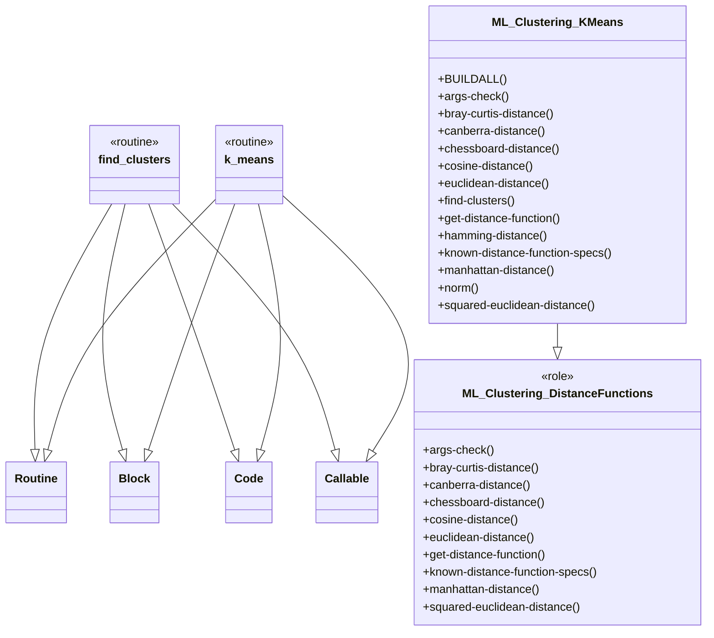

# Raku ML::Clustering

[](https://ci.sparrowhub.io)
[](https://opensource.org/licenses/Artistic-2.0)

This repository has the code of a Raku package for
Machine Learning (ML)
[Clustering (or Cluster analysis)](https://en.wikipedia.org/wiki/Cluster_analysis)
functions, [Wk1].

The Clustering framework includes:

- The algorithms 
  [K-means](https://en.wikipedia.org/wiki/K-means_clustering) 
  and 
  [K-medoids](https://en.wikipedia.org/wiki/K-medoids), 
  and others

- The distance functions Euclidean, Cosine, Hamming, Manhattan, and others,
  and their corresponding similarity functions

The data in the examples below is generated and manipulated with the packages
["Data::Generators"](https://raku.land/zef:antononcube/Data::Generators),
["Data::Reshapers"](https://raku.land/zef:antononcube/Data::Reshapers), and
["Data::Summarizers"](https://raku.land/zef:antononcube/Data::Summarizers), described in the article
["Introduction to data wrangling with Raku"](https://rakuforprediction.wordpress.com/2021/12/31/introduction-to-data-wrangling-with-raku/),
[AA1].

The plots are made with the package
["Text::Plot"](https://raku.land/zef:antononcube/Text::Plot), [AAp6].

-------

## Installation

Via zef-ecosystem:

```
zef install ML::Clustering
```

From GitHub:

```
zef install https://github.com/antononcube/Raku-ML-Clustering
```

-------

## Usage example

Here we derive a set of random points, and summarize it:

```perl6
use Data::Generators;
use Data::Summarizers;
use Text::Plot;

my $n = 100;
my @data1 = (random-variate(NormalDistribution.new(5,1.5), $n) X random-variate(NormalDistribution.new(5,1), $n)).pick(30);
my @data2 = (random-variate(NormalDistribution.new(10,1), $n) X random-variate(NormalDistribution.new(10,1), $n)).pick(50);
my @data3 = [|@data1, |@data2].pick(*);
records-summary(@data3)
```
```
# +------------------------------+------------------------------+
# | 1                            | 0                            |
# +------------------------------+------------------------------+
# | Min    => 2.7347892318441853 | Min    => 2.7829663051730122 |
# | 1st-Qu => 5.445914950285739  | 1st-Qu => 5.716040979452782  |
# | Mean   => 8.176626293030205  | Mean   => 8.004271747317972  |
# | Median => 9.3706132234432    | Median => 9.16395316329162   |
# | 3rd-Qu => 10.268064211087841 | 3rd-Qu => 9.984928094440164  |
# | Max    => 11.483204195155919 | Max    => 12.467908322582032 |
# +------------------------------+------------------------------+
```

Here we plot the points:

```perl6
use Text::Plot;
text-list-plot(@data3)
```
```
# +---------+----------+---------+----------+----------+-----+       
# +                                                          +  12.00
# |                               *  *  **  * * *     *      |       
# +                                     *** ** *    *        +  10.00
# |                           *      ****  ****          *   |       
# |                                *       *    *   *        |       
# +                  **              *  *   *                +   8.00
# |      *     * *   * *                                     |       
# +   *                                                      +   6.00
# |          *       * *                                     |       
# |   *   ** *    * ** **     *                              |       
# +                 ** *             *                       +   4.00
# |       *   *      *                                       |       
# +                                                          +   2.00
# +---------+----------+---------+----------+----------+-----+       
#           4.00       6.00      8.00       10.00      12.00
```

**Problem:** Group the points in such a way that each group has close (or similar) points.

Here is how we use the function `find-clusters` to give an answer:

```perl6
use ML::Clustering;
my %res = find-clusters(@data3, 2, prop => 'All');
%res<Clusters>>>.elems
```
```
# (30 50)
```

**Remark:** The first argument is data points that is a list-of-numeric-lists. 
The second argument is a number of clusters to be found. 
(It is in the TODO list to have the number clusters automatically determined -- currently they are not.)  

**Remark:** The function `find-clusters` can return results of different types controlled with the named argument "prop".
Using `prop => 'All'` returns a hash with all properties of the cluster finding result.

Here are sample points from each found cluster:

```perl6
.say for %res<Clusters>>>.pick(3);
```
```
# ((6.119787650922214 4.3460991143937155) (2.8184813681006387 6.194455975464421) (4.146182920737956 4.48149915185223))
# ((10.148258671995263 10.421539222116792) (9.984928094440164 9.485326329189661) (9.269111577015677 10.129398397646888))
```

Here are the centers of the clusters (the mean points):

```perl6
%res<MeanPoints>
```
```
# [(5.686348428932858 5.660945893906989) (9.795457276967502 10.100628996937822)]
```

We can verify the result by looking at the plot of the found clusters:

```perl6
text-list-plot((|%res<Clusters>, %res<MeanPoints>), point-char => <▽ ☐ ●>, title => '▽ - 1st cluster; ☐ - 2nd cluster; ● - cluster centers')
```
```
# ▽ - 1st cluster; ☐ - 2nd cluster; ● - cluster centers    
# +--------+-----------+----------+----------+----------+----+       
# +                               ☐                          +  12.00
# |                                  ☐  ☐☐  ☐☐☐☐ ☐     ☐     |       
# +                            ☐     ☐☐  ☐☐☐●☐☐☐☐    ☐     ☐ +  10.00
# |                                 ☐☐  ☐☐ ☐ ☐               |       
# |                                 ☐      ☐     ☐   ☐       |       
# +                  ▽               ☐   ☐   ☐               +   8.00
# |     ▽     ▽  ▽   ▽ ▽                                     |       
# +  ▽                                                       +   6.00
# |          ▽       ● ▽                                     |       
# |      ▽  ▽     ▽▽ ▽        ▽                              |       
# +  ▽    ▽        ▽ ▽ ▽▽            ▽                       +   4.00
# |           ▽      ▽                                       |       
# |      ▽                                                   |       
# +--------+-----------+----------+----------+----------+----+       
#          4.00        6.00       8.00       10.00      12.00
```

**Remark:** By default `find-clusters` uses the K-means algorithm. The functions `k-means` and `k-medoids`
call `find-clusters` with the option settings `method=>'K-means'` and `method=>'K-medoids'` respectively.

------

## More interesting looking data

Here is more interesting looking two-dimensional data, `data2D2`:

```perl6
use Data::Reshapers;
my $pointsPerCluster = 200;
my @data2D5 = [[10,20,4],[20,60,6],[40,10,6],[-30,0,4],[100,100,8]].map({ 
    random-variate(NormalDistribution.new($_[0], $_[2]), $pointsPerCluster) Z random-variate(NormalDistribution.new($_[1], $_[2]), $pointsPerCluster)
   }).Array;
@data2D5 = flatten(@data2D5, max-level=>1).pick(*);
@data2D5.elems
```
```
# 1000
```

Here is a plot of that data:

```perl6
text-list-plot(@data2D5)
```
```
# +---------------+---------------+----------------+---------+        
# |                                                          |        
# |                                            ***** ***     |        
# +                                       ****************   +  100.00
# |                                        * ************    |        
# |                      *                       ** **       |        
# |                  *********                               |        
# |                ************                              |        
# +                  *****  **                               +   50.00
# |                * ***                                     |        
# |               ******** ******** *                        |        
# |   *******       ****   ********** *                      |        
# +   ******              *  *****                           +    0.00
# |                                                          |        
# +---------------+---------------+----------------+---------+        
#                 0.00            50.00            100.00
```

Here we find clusters and plot them together with their mean points:

```perl6
srand(32);
my %clRes = find-clusters(@data2D5, 5, prop=>'All');
text-list-plot([|%clRes<Clusters>, %clRes<MeanPoints>], point-char=><1 2 3 4 5 ●>)
```
```
# +--------------+----------------+-----------------+--------+        
# +                                             2 2          +  120.00
# |                                             2222222222   |        
# +                                       2 2 222222●2222222 +  100.00
# |                                         2 22222222222 2  |        
# +                     1                          2  2      +   80.00
# |                 111111111                                |        
# +              1 11111●111111                              +   60.00
# |                 11111  11                                |        
# +                  33                                      +   40.00
# +              33333333 3 3 33333                          +   20.00
# |4  55  5      3 333333●33333333333 3                      |        
# + 4●55●55               33333333 3                         +    0.00
# | 444555                    33                             |        
# +--------------+----------------+-----------------+--------+        
#                0.00             50.00             100.00
```

-------

## Detailed function pages

Detailed parameter explanations and usage examples for the functions provided by the package are given in:

- ["K-means function page"](./doc/K-means-function-page.md)

- ["K-medoids function page"]()

- ["Bi-sectional-K-means function page"]()

-------

## Implementation considerations

### UML diagram

Here is a UML diagram that shows package's structure (in Mermaid-JS):

```shell, output.prompt=NONE, output.lang=mermaid
to-uml-spec ML::Clustering --format=mermaid
```


**Remark:** Maybe it is a good idea to have an abstract class named, say,
`ML::Clustering::AbstractFinder` that is a parent of
`ML::Clustering::KMeans`, `ML::Clustering::KMedoids`, `ML::Clustering::BiSectionalKMeans`, etc.,
but I have not found to be necessary. (At this point of development.)

**Remark:** It seems it is better to have a separate package for the distance functions, named, say,
"ML::DistanceFunctions". (Although distance functions are not just for ML...)
After thinking over package and function names I will make such a package. 

-------

## TODO

- [ ] TODO Implement Bi-sectional K-means algorithm, [AAp1].

- [ ] TODO Implement K-medoids algorithm.

- [ ] TODO Automatic determination of the number of clusters.

- [ ] TODO Allow data points to be `Pair` objects the keys of which are point labels.

   - Hence, the returned clusters consist of those labels, not points themselves.

- [ ] TODO Implement Agglomerate algorithm.

- [ ] TODO Factor-out the distance functions in a separate package.

-------

## References

### Articles

[Wk1] Wikipedia entry, ["Cluster Analysis"](https://en.wikipedia.org/wiki/Cluster_analysis).

[AA1] Anton Antonov,
["Introduction to data wrangling with Raku"](https://rakuforprediction.wordpress.com/2021/12/31/introduction-to-data-wrangling-with-raku/),
(2021),
[RakuForPrediction at WordPress](https://rakuforprediction.wordpress.com).

### Packages

[AAp1] Anton Antonov,
[Bi-sectional K-means algorithm in Mathematica](https://github.com/antononcube/MathematicaForPrediction/blob/master/BiSectionalKMeans.m),
(2020),
[MathematicaForPrediction at GitHub/antononcube](https://github.com/antononcube/MathematicaForPrediction/).

[AAp2] Anton Antonov,
[Data::Generators Raku package](https://github.com/antononcube/Raku-Data-Generators),
(2021),
[GitHub/antononcube](https://github.com/antononcube).

[AAp3] Anton Antonov,
[Data::Reshapers Raku package](https://github.com/antononcube/Raku-Data-Reshapers),
(2021),
[GitHub/antononcube](https://github.com/antononcube).

[AAp4] Anton Antonov,
[Data::Summarizers Raku package](https://github.com/antononcube/Raku-Data-Summarizers),
(2021),
[GitHub/antononcube](https://github.com/antononcube).

[AAp5] Anton Antonov,
[UML::Translators Raku package](https://github.com/antononcube/Raku-UML-Translators),
(2022),
[GitHub/antononcube](https://github.com/antononcube).

[AAp6] Anton Antonov,
[Text::Plot Raku package](https://raku.land/zef:antononcube/Text::Plot),
(2022),
[GitHub/antononcube](https://github.com/antononcube).
