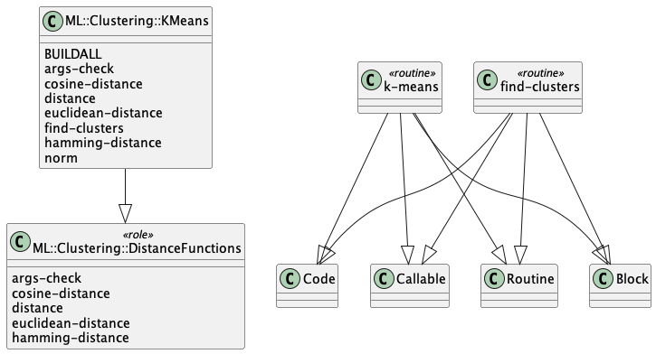

# Raku ML::Clustering

[](http://sparrowhub.io:2222)
[](https://opensource.org/licenses/Artistic-2.0)

This repository has the code of a Raku package for
Machine Learning (ML)
[Clustering (or Cluster analysis)](https://en.wikipedia.org/wiki/Cluster_analysis)
functions, [Wk1].

The Clustering framework includes:

- The algorithms 
  [K-means](https://en.wikipedia.org/wiki/K-means_clustering) 
  and 
  [K-medoids](https://en.wikipedia.org/wiki/K-medoids), 
  and others

- The distance functions Euclidean, Cosine, Hamming, Manhattan, and others,
  and their corresponding similarity functions

The data in the examples below is generated and manipulated with the packages
["Data::Generators"](https://raku.land/zef:antononcube/Data::Generators),
["Data::Reshapers"](https://raku.land/zef:antononcube/Data::Reshapers), and
["Data::Summarizers"](https://raku.land/zef:antononcube/Data::Summarizers), described in the article
["Introduction to data wrangling with Raku"](https://rakuforprediction.wordpress.com/2021/12/31/introduction-to-data-wrangling-with-raku/),
[AA1].

The plots are made with the package
["Text::Plot"](https://raku.land/zef:antononcube/Text::Plot), [AAp6].

-------

## Installation

Via zef-ecosystem:

```shell
zef install ML::Clustering
```

From GitHub:

```shell
zef install https://github.com/antononcube/Raku-ML-Clustering
```

-------

## Cluster finding 

Here we derive a set of random points, and summarize it:

```perl6
use Data::Generators;
use Data::Summarizers;
use Text::Plot;

my $n = 100;
my @data1 = (random-variate(NormalDistribution.new(5,1.5), $n) X random-variate(NormalDistribution.new(5,1), $n)).pick(30);
my @data2 = (random-variate(NormalDistribution.new(10,1), $n) X random-variate(NormalDistribution.new(10,1), $n)).pick(50);
my @data3 = [|@data1, |@data2].pick(*);
records-summary(@data3)
```
```
# +------------------------------+------------------------------+
# | 0                            | 1                            |
# +------------------------------+------------------------------+
# | Min    => 2.431504840729811  | Min    => 2.784278085085211  |
# | 1st-Qu => 5.789177747371887  | 1st-Qu => 5.173796549870958  |
# | Mean   => 7.997780541321374  | Mean   => 7.90750527014674   |
# | Median => 8.770180716381228  | Median => 9.129547822181223  |
# | 3rd-Qu => 10.09385278918844  | 3rd-Qu => 9.978596862216286  |
# | Max    => 11.830482124550754 | Max    => 12.569673195462167 |
# +------------------------------+------------------------------+
```

Here we plot the points:

```perl6
use Text::Plot;
text-list-plot(@data3)
```
```
# ++----------+----------+----------+----------+----------+--+       
# |                                                          |       
# +                                        *             *   +  12.00
# |                                    *                     |       
# +                              *      *  **  *******       +  10.00
# |                              *    *****  * ** * * *      |       
# |                                    ***     *****         |       
# +                                                          +   8.00
# |                   * *              *                     |       
# +            *        * *  *                               +   6.00
# |   *     *         **     *         *                     |       
# +   *       *      *      **                               +   4.00
# |   *    * * *        *   *   *                            |       
# +                                                          +   2.00
# ++----------+----------+----------+----------+----------+--+       
#  2.00       4.00       6.00       8.00       10.00      12.00
```

**Problem:** Group the points in such a way that each group has close (or similar) points.

Here is how we use the function `find-clusters` to give an answer:

```perl6
use ML::Clustering;
my %res = find-clusters(@data3, 2, prop => 'All');
%res<Clusters>>>.elems
```
```
# (50 30)
```

**Remark:** The first argument is data points that is a list-of-numeric-lists. 
The second argument is a number of clusters to be found. 
(It is in the TODO list to have the number clusters automatically determined -- currently they are not.)  

**Remark:** The function `find-clusters` can return results of different types controlled with the named argument "prop".
Using `prop => 'All'` returns a hash with all properties of the cluster finding result.

Here are sample points from each found cluster:

```perl6
.say for %res<Clusters>>>.pick(3);
```
```
# ((10.489127748912201 10.636486137321732) (10.182826334247748 10.320164278135902) (11.830482124550754 12.410313239926042))
# ((4.064917894452489 5.814336233391266) (5.448488985158138 5.173796549870958) (6.482579924985464 3.048388211050267))
```

Here are the centers of the clusters (the mean points):

```perl6
%res<MeanPoints>
```
```
# [(6.158452081602929 5.906621032107129) (9.899660024400607 9.899441235784515)]
```

We can verify the result by looking at the plot of the found clusters:

```perl6
text-list-plot((|%res<Clusters>, %res<MeanPoints>), point-char => <▽ ☐ ●>, title => '▽ - 1st cluster; ☐ - 2nd cluster; ● - cluster centers')
```
```
# ▽ - 1st cluster; ☐ - 2nd cluster; ● - cluster centers    
# +-----------+----------+-----------+----------+-----------++       
# |                                         ▽              ▽ |       
# +                                                        ▽ +  12.00
# |                                     ▽    ▽  ▽   ▽        |       
# +                              ▽       ▽  ▽▽  ●▽▽▽▽ ▽      +  10.00
# |                                    ▽ ▽▽▽  ▽▽▽▽ ▽ ▽ ▽     |       
# |                                     ▽       ▽▽▽▽▽        |       
# +                                                          +   8.00
# |                   ☐ ☐               ☐                    |       
# +           ☐         ☐ ●  ☐                               +   6.00
# |        ☐         ☐☐☐     ☐          ☐                    |       
# +  ☐        ☐             ☐☐                               +   4.00
# |  ☐       ☐☐      ☐  ☐   ☐   ☐                            |       
# |       ☐                                                  |       
# +-----------+----------+-----------+----------+-----------++       
#             4.00       6.00        8.00       10.00       12.00
```

**Remark:** By default `find-clusters` uses the K-means algorithm. The functions `k-means` and `k-medoids`
call `find-clusters` with the option settings `method=>'K-means'` and `method=>'K-medoids'` respectively.

------

## More interesting looking data

Here is more interesting looking two-dimensional data, `data2D2`:

```perl6
use Data::Reshapers;
my $pointsPerCluster = 200;
my @data2D5 = [[10,20,4],[20,60,6],[40,10,6],[-30,0,4],[100,100,8]].map({ 
    random-variate(NormalDistribution.new($_[0], $_[2]), $pointsPerCluster) Z random-variate(NormalDistribution.new($_[1], $_[2]), $pointsPerCluster)
   }).Array;
@data2D5 = flatten(@data2D5, max-level=>1).pick(*);
@data2D5.elems
```
```
# 1000
```

Here is a plot of that data:

```perl6
text-list-plot(@data2D5)
```
```
# +---------------+---------------+----------------+---------+        
# |                                                          |        
# |                                          *  * ***    *   |        
# +                                        **************    +  100.00
# |                                         * ************   |        
# |                       **                  ******* ** *   |        
# |                * *********                               |        
# |                 ********** *                             |        
# +                   ***** **                               +   50.00
# |                 ****                                     |        
# |               *******   **** ** *                        |        
# |   ******       *****   ********* *                       |        
# +   *******                *******                         +    0.00
# |                                                          |        
# +---------------+---------------+----------------+---------+        
#                 0.00            50.00            100.00
```

Here we find clusters and plot them together with their mean points:

```perl6
srand(32);
my %clRes = find-clusters(@data2D5, 5, prop=>'All');
text-list-plot([|%clRes<Clusters>, %clRes<MeanPoints>], point-char=><1 2 3 4 5 ●>)
```
```
# +--------------+-----------------+----------------+--------+        
# |                                           5     5        |        
# +                                           5 555 55555 55 +  120.00
# +                                         55555555●55555   +  100.00
# |                                          5 555555555555  |        
# +                      11                     55 5  5 5  5 +   80.00
# |               1 1111111111                               |        
# +                11111●11111 1                             +   60.00
# |                  11111 11                                |        
# +                3 3                                       +   40.00
# +             3333●333   44444 44                          +   20.00
# | 22222         333333  44444●44444                        |        
# +2222●222                444444444 4                       +    0.00
# |  22222                       4                           |        
# +--------------+-----------------+----------------+--------+        
#                0.00              50.00            100.00
```

-------

## Control parameters (named arguments)

In this section we describe the named arguments of `find-clusters` that can be used to
control the cluster finding process.

### Distance function

The value of the argument `distance-function` specifies the distance function to be used -- 
close points tend to be placed in the same cluster. 
Here is example comparing the "standard" Geometry distance, `euclidean-distance`, 
with the "directional" distance, `cosine-distance`:

***TBD...***

Instead of distance functions we can use string identifiers of those functions:

```perl6
<Euclidean Cosine>.map({ say find-clusters(@data2D5, 3, distance-function => $_).&text-list-plot(title => 'distance function: ' ~ $_, point-char=><* ® o>), "\n"});
```
```
# distance function: Euclidean                
# +--------------+-----------------+----------------+--------+        
# |                                           *     *        |        
# +                                           * *** ***** ** +  120.00
# +                                         **************   +  100.00
# |                                          * ************  |        
# +                      oo                     ** *  * *  * +   80.00
# |               o oooooooooo                               |        
# +                ooooooooooo o                             +   60.00
# +                  ooooo oo                                +   40.00
# |                o o                                       |        
# +             oooooooo   ooooo oo                          +   20.00
# | ®®®®®         ooooo   oooooooooooo                       |        
# +®®®®®®®®                ooooooooo                         +    0.00
# |  ®®®®®                       o                           |        
# +--------------+-----------------+----------------+--------+        
#                0.00              50.00            100.00            
# 
#                  distance function: Cosine                  
# +--------------+----------------+----------------+---------+        
# |                                                          |        
# +                                          *  * **** *  *  +  120.00
# |                                        **************    |        
# +                                         **************   +  100.00
# +                      *                    *** ***  ** *  +   80.00
# |               * *********                                |        
# +               *************                              +   60.00
# |                ******* **                                |        
# +                * *                                       +   40.00
# +             ********   ®®®® ®®                           +   20.00
# | oooo         ****®*   ®®®®®®®®®®                         |        
# +oooooooo               ®®®®®®®®® ®                        +    0.00
# |  ooooo                      ®                            |        
# +--------------+----------------+----------------+---------+        
#                0.00             50.00            100.00
```

### Learning parameter

At a certain execution step of the algorithm the learning parameter specifies how much the 
current mean points have to be "pulled" in the direction of the estimated new points. 
Smaller values of the named argument `learning-parameter` correspond to more cautious learning:

```perl6
(0.01, 0.1, 0.7).map({ say find-clusters(@data2D5, 2, learning-parameter => $_).&text-list-plot(title => 'learning-parameter:' ~ $_.Str, point-char=><* o>), "\n"});
```
```
# learning-parameter:0.01                   
# +---------------+----------------+----------------+--------+        
# +                                           *     *        +  120.00
# |                                           * *** ***** ** |        
# +                                         **************   +  100.00
# |                                          * ************  |        
# +                      ooo                    ** *  * *  * +   80.00
# |                o oooooooooo                              |        
# +                 ooooooooooo o                            +   60.00
# +                   oooo  oo                               +   40.00
# |                 oooo                                     |        
# +              oooooooo   ooooooooo                        +   20.00
# |  ooooo         ooooo   ooooooooooo                       |        
# +  ooooooo                ooooooooo                        +    0.00
# |    ooo                                                   |        
# +---------------+----------------+----------------+--------+        
#                 0.00             50.00            100.00            
# 
#                    learning-parameter:0.1                   
# +---------------+----------------+----------------+--------+        
# +                                           o     o        +  120.00
# |                                           o ooo ooooo oo |        
# +                                         oooooooooooooo   +  100.00
# |                                          o oooooooooooo  |        
# +                      ***                    oo o  o o  o +   80.00
# |                * **********                              |        
# +                 *********** *                            +   60.00
# +                   ****  **                               +   40.00
# |                 ****                                     |        
# +              ********   *********                        +   20.00
# |  *****         *****   ***********                       |        
# +  *******                *********                        +    0.00
# |    ***                                                   |        
# +---------------+----------------+----------------+--------+        
#                 0.00             50.00            100.00            
# 
#                    learning-parameter:0.7                   
# +---------------+----------------+----------------+--------+        
# +                                           o     o        +  120.00
# |                                           o ooo ooooo oo |        
# +                                         oooooooooooooo   +  100.00
# |                                          o oooooooooooo  |        
# +                      ***                    oo o  o o  o +   80.00
# |                * **********                              |        
# +                 *********** *                            +   60.00
# +                   ****  **                               +   40.00
# |                 ****                                     |        
# +              ********   *********                        +   20.00
# |  *****         *****   ***********                       |        
# +  *******                *********                        +    0.00
# |    ***                                                   |        
# +---------------+----------------+----------------+--------+        
#                 0.00             50.00            100.00
```

We see the plots above that with smaller learning parameter better results are obtained. 
But keep in mind that in some situations that small learning parameters can make 
the computations too slow or produce worse clustering results.

### Maximum steps

The value m of the named argument `max-steps` is used in the stopping criteria of the implemented K-means algorithm -- 
if in the number of iterations exceeds m then the algorithms stops. 
Here is example that shows better clustering results is obtained with larger max steps:

```perl6
(1, 4, 100).map({ say find-clusters(@data2D5, 2, max-steps => $_).&text-list-plot(title => 'maximum steps: ' ~ $_.Str, point-char=><* o>), "\n" });
```
```
# maximum steps: 1                      
# +---------------+---------------+----------------+---------+        
# |                                           o              |        
# |                                             o  ooo o  o  |        
# +                                         oooooooooooooo   +  100.00
# |                                          ooooooooooooo   |        
# |                       o                    oo oooo oo o  |        
# |                ****ooooooo                               |        
# |                 ****oooooo o                             |        
# +                  *******o                                +   50.00
# |                 ***                                      |        
# |              ********  ***** *o                          |        
# |  *****         *****   *********o*                       |        
# +  *******                ********                         +    0.00
# |    ****                      *                           |        
# +---------------+---------------+----------------+---------+        
#                 0.00            50.00            100.00             
# 
#                       maximum steps: 4                      
# +---------------+----------------+----------------+--------+        
# +                                           *     *        +  120.00
# |                                           * *** ***** ** |        
# +                                         **************   +  100.00
# |                                          * ************  |        
# +                      ooo                    ** *  * *  * +   80.00
# |                o oooooooooo                              |        
# +                 ooooooooooo o                            +   60.00
# +                   oooo  oo                               +   40.00
# |                 oooo                                     |        
# +              oooooooo   ooooooooo                        +   20.00
# |  ooooo         ooooo   ooooooooooo                       |        
# +  ooooooo                ooooooooo                        +    0.00
# |    ooo                                                   |        
# +---------------+----------------+----------------+--------+        
#                 0.00             50.00            100.00            
# 
#                      maximum steps: 100                     
# +---------------+----------------+----------------+--------+        
# +                                           o     o        +  120.00
# |                                           o ooo ooooo oo |        
# +                                         oooooooooooooo   +  100.00
# |                                          o oooooooooooo  |        
# +                      ***                    oo o  o o  o +   80.00
# |                * **********                              |        
# +                 *********** *                            +   60.00
# +                   ****  **                               +   40.00
# |                 ****                                     |        
# +              ********   *********                        +   20.00
# |  *****         *****   ***********                       |        
# +  *******                *********                        +    0.00
# |    ***                                                   |        
# +---------------+----------------+----------------+--------+        
#                 0.00             50.00            100.00
```

### Minimum reassignments fraction

The value `m` of the option "min-reassignments-fraction" is used in the stopping criteria of the implemented K-means algorithm -- 
if in the last iteration step the fraction of the number of points that have changed clusters is less m then the algorithms stops. 
Here is example that shows better clustering results is obtained with a smaller fraction:

```perl6
srand(9);
(0.01, 0.3).map({ say find-clusters(@data2D5, 3, min-reassigments-fraction => $_).&text-list-plot(title => 'min-reassigments-fraction: ' ~ $_.Str, point-char=>Whatever), "\n" });
```
```
# min-reassigments-fraction: 0.01               
# +--------------+-----------------+----------------+--------+        
# |                                           □     □        |        
# +                                           □ □□□ □□□□□ □□ +  120.00
# +                                         □□□□□□□□□□□□□□   +  100.00
# |                                          □ □□□□□□□□□□□□  |        
# +                      **                     □□ □  □ □  □ +   80.00
# |               * **********                               |        
# +                *********** *                             +   60.00
# +                  ***** **                                +   40.00
# |                * *                                       |        
# +             ********   ***** **                          +   20.00
# | ❍❍❍❍❍         *****   ************                       |        
# +❍❍❍❍❍❍❍❍                *********                         +    0.00
# |  ❍❍❍❍❍                       *                           |        
# +--------------+-----------------+----------------+--------+        
#                0.00              50.00            100.00            
# 
#                min-reassigments-fraction: 0.3               
# +--------------+-----------------+----------------+--------+        
# |                                           *     *        |        
# +                                           * *** ***** ** +  120.00
# +                                         **************   +  100.00
# |                                          * ************  |        
# +                      □□                     ** *  * *  * +   80.00
# |               □ □□□□□□□□□□                               |        
# +                □□□□□□□□□□□ □                             +   60.00
# +                  □□□□□ □□                                +   40.00
# |                □ □                                       |        
# +             □□□□□□□□   □□□□□ □□                          +   20.00
# | ❍❍❍❍❍         □□□□□   □□□□□□□□□□□□                       |        
# +❍❍❍❍❍❍❍❍                □□□□□□□□□                         +    0.00
# |  ❍❍❍❍❍                       □                           |        
# +--------------+-----------------+----------------+--------+        
#                0.00              50.00            100.00
```

### Precision goal

The value `p` of the named argument `precision-goal` is used specify in stopping criteria that evaluates 
the differences between the "old" and "new" clusters centers -- 
if the maximum of that difference is less than `10 ** (-p)` then the cluster finding iterations stop. 
Here is example that shows using the different precision goals:

```perl6
srand(1921);
(0.2, 5).map({ say find-clusters(@data2D5, 2, precision-goal => $_).&text-list-plot(title => 'precision goal: ' ~ $_.Str, point-char=>Whatever), "\n" });
```
```
# precision goal: 0.2                     
# +---------------+----------------+----------------+--------+        
# +                                           *     *        +  120.00
# |                                           * *** ***** ** |        
# +                                         **************   +  100.00
# |                                          * ************  |        
# +                      □□□                    ** *  * *  * +   80.00
# |                □ □□□□□□□□□□                              |        
# +                 □□□□□□□□□□□ □                            +   60.00
# +                   □□□□  □□                               +   40.00
# |                 □□□□                                     |        
# +              □□□□□□□□   □□□□□□□□□                        +   20.00
# |  □□□□□         □□□□□   □□□□□□□□□□□                       |        
# +  □□□□□□□                □□□□□□□□□                        +    0.00
# |    □□□                                                   |        
# +---------------+----------------+----------------+--------+        
#                 0.00             50.00            100.00            
# 
#                      precision goal: 5                      
# +---------------+----------------+----------------+--------+        
# +                                           □     □        +  120.00
# |                                           □ □□□ □□□□□ □□ |        
# +                                         □□□□□□□□□□□□□□   +  100.00
# |                                          □ □□□□□□□□□□□□  |        
# +                      ***                    □□ □  □ □  □ +   80.00
# |                * **********                              |        
# +                 *********** *                            +   60.00
# +                   ****  **                               +   40.00
# |                 ****                                     |        
# +              ********   *********                        +   20.00
# |  *****         *****   ***********                       |        
# +  *******                *********                        +    0.00
# |    ***                                                   |        
# +---------------+----------------+----------------+--------+        
#                 0.00             50.00            100.00
```

-------

## Implementation considerations

### UML diagram

Here is a UML diagram that shows package's structure:




The
[PlantUML spec](./resources/class-diagram.puml)
and
[diagram](./resources/class-diagram.png)
were obtained with the CLI script `to-uml-spec` of the package "UML::Translators", [AAp6].

Here we get the [PlantUML spec](./resources/class-diagram.puml):

```shell
to-uml-spec ML::AssociationRuleLearning > ./resources/class-diagram.puml
```

Here get the [diagram](./resources/class-diagram.png):

```shell
to-uml-spec ML::Clustering | java -jar ~/PlantUML/plantuml-1.2022.5.jar -pipe > ./resources/class-diagram.png
```

**Remark:** Maybe it is a good idea to have an abstract class named, say,
`ML::Clustering::AbstractFinder` that is a parent of
`ML::Clustering::KMeans`, `ML::Clustering::KMedoids`, `ML::Clustering::BiSectionalKMeans`, etc.,
but I have not found to be necessary. (At this point of development.)

**Remark:** It seems it is better to have a separate package for the distance functions, named, say,
"ML::DistanceFunctions". (Although distance functions are not just for ML...)
After thinking over package and function names I will make such a package. 

-------

## TODO

- [ ] Implement Bi-sectional K-means algorithm, [AAp1].

- [ ] Implement K-medoids algorithm.

- [ ] Automatic determination of the number of clusters.

- [ ] Allow data points to be `Pair` objects the keys of which are point labels.

   - Hence, the returned clusters consist of those labels, not points themselves.

- [ ] Implement Agglomerate algorithm.

- [ ] Factor-out the distance functions in a separate package.

-------

## References

### Articles

[Wk1] Wikipedia entry, ["Cluster Analysis"](https://en.wikipedia.org/wiki/Cluster_analysis).

[AA1] Anton Antonov,
["Introduction to data wrangling with Raku"](https://rakuforprediction.wordpress.com/2021/12/31/introduction-to-data-wrangling-with-raku/),
(2021),
[RakuForPrediction at WordPress](https://rakuforprediction.wordpress.com).

### Packages

[AAp1] Anton Antonov,
[Bi-sectional K-means algorithm in Mathematica](https://github.com/antononcube/MathematicaForPrediction/blob/master/BiSectionalKMeans.m),
(2020),
[MathematicaForPrediction at GitHub/antononcube](https://github.com/antononcube/MathematicaForPrediction/).

[AAp2] Anton Antonov,
[Data::Generators Raku package](https://github.com/antononcube/Raku-Data-Generators),
(2021),
[GitHub/antononcube](https://github.com/antononcube).

[AAp3] Anton Antonov,
[Data::Reshapers Raku package](https://github.com/antononcube/Raku-Data-Reshapers),
(2021),
[GitHub/antononcube](https://github.com/antononcube).

[AAp4] Anton Antonov,
[Data::Summarizers Raku package](https://github.com/antononcube/Raku-Data-Summarizers),
(2021),
[GitHub/antononcube](https://github.com/antononcube).

[AAp5] Anton Antonov,
[UML::Translators Raku package](https://github.com/antononcube/Raku-UML-Translators),
(2022),
[GitHub/antononcube](https://github.com/antononcube).

[AAp6] Anton Antonov,
[Text::Plot Raku package](https://raku.land/zef:antononcube/Text::Plot),
(2022),
[GitHub/antononcube](https://github.com/antononcube).
